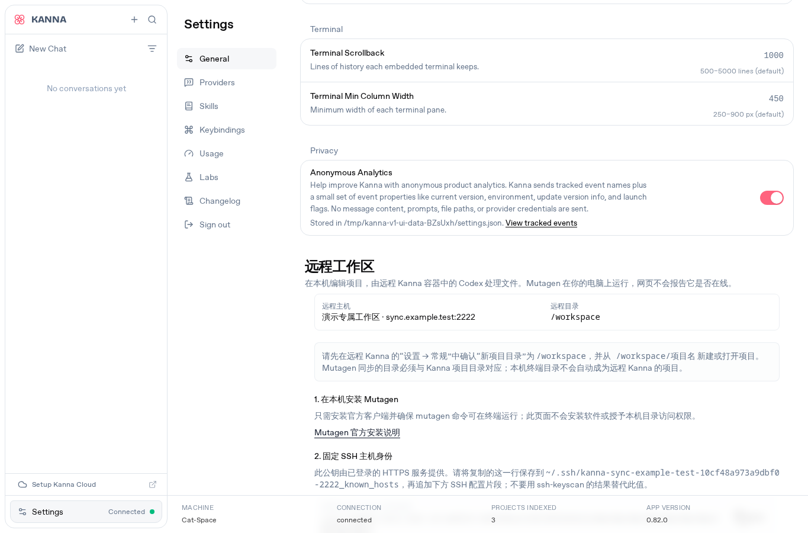
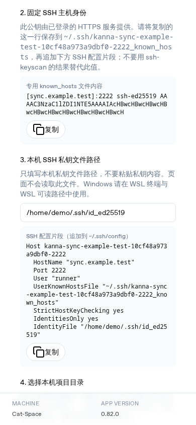

# 远程 Kanna 工作区

这套部署为每个账号启动独立的 Kanna app、SSH sidecar、网络、工作区和持久 HOME。默认子域模式由 Caddy 根据 `<账号>.<域名>` 转发 HTTPS 请求；shared 模式改用同一 hostname 的账号专属 HTTPS 端口。SSH 只接受该账号提供的公钥。Kanna app 固定以非 root UID/GID 运行，SSH 登录映射到普通 `workspace` 用户。SSH shell 保持可用，供 Mutagen 启动远程同步 helper；root 登录、密码认证、端口/代理转发均关闭。

> 本机 Linux/Docker 验收已通过：镜像构建、两账号隔离、SSH 公钥登录、Mutagen 双向同步与冲突恢复、备份恢复、Linux PTY 行为，以及 shared internal CA 下的严格 TLS 浏览器流程和 SSH/Mutagen E2E。浏览器验证覆盖双 origin 登录、媒体和 Range 请求、下载、Service Worker 生命周期及注销。公网域名/DNS/NAT、浏览器对公网证书的信任和真实 Codex 账号模型任务尚未验证。GitHub CI 的当前状态见 [PR #2](https://github.com/Zhao-zixi/codex-web-linux/pull/2)，不要将其状态从本机验收推断出来。

## 支持范围与前置条件

部署主机要求 Linux、Docker Engine、Docker Compose v2、Bun 1.4.2 或更高版本、OpenSSH 客户端工具、`jq`、Mutagen CLI，以及可以写入持久目录的 UID/GID。公网部署需要域名 DNS 记录指向主机，并开放每个账号单独的 SSH TCP 端口。子域模式的 ACME HTTPS 需要按其配置开放 80/443；shared 高端口模式使用所配置的 HTTPS 端口，不依赖公网 80/443。首版只接受 DNS 名称或 IPv4 地址；IPv6 literal 不支持，Mutagen 连接请使用 DNS 名称或本地 SSH alias。

开发与生成 CLI 使用 Bun。请从 [Bun 官方安装说明](https://bun.sh/docs/installation) 安装，不要通过未经审阅的 `curl | sh` 命令安装。Mutagen 请从 [Mutagen 官方安装文档](https://mutagen.io/documentation/introduction/installation/) 选择对应平台的发行版；Docker 请按 [Docker Engine 官方文档](https://docs.docker.com/engine/install/) 安装。`doctor` 会检查 Docker daemon、Compose、`ssh-keygen`、Mutagen、`jq` 和已初始化状态的目录权限；任一必需项失败都会返回非零状态。

## 单域名、多 HTTPS 端口部署（fnOS）

如果域名 `fnos.zixizhao.top` 已指向 fnOS，且 80、443、8443 正被 fnOS 服务使用，可以让工作区在同一 hostname 的独立高端口提供 HTTPS。此方式不新增 DNS 记录，也不改变 fnOS 原有服务监听；例如 `elim` 使用 `https://fnos.zixizhao.top:8444` 和 SSH TCP 2222，`zzx` 使用 `https://fnos.zixizhao.top:8445` 和 SSH TCP 2223。确保这些高端口未被其它服务占用，并在主机防火墙及路由器 NAT 中分别放行/转发 8444、8445、2222、2223。不要转发或改写 fnOS 的 80、443、8443 规则。

使用 external TLS 时，需要一张由客户端信任、且 SAN 覆盖 `fnos.zixizhao.top` 的现有证书链和对应私钥。运维应先确认公钥证书与私钥配对，并验证证书链和有效期。把证书和私钥保存在部署目录之外或专用证书目录，给 Caddy 容器只读挂载；私钥文件应限制为管理员可读，绝不能提交 Git、放入账号 bundle 或发给工作区用户。CLI 会检查文件路径与权限，不会替代证书信任和配对校验；不要把证书或私钥内容贴进终端记录、聊天或 issue。

下面的初始化参数已由当前 CLI 提供。将示例中的证书路径替换为管理员实际维护的 PEM 文件路径：

```sh
bun run remote-workspace -- init \
  --hostname-mode shared \
  --tls-mode external \
  --public-hostname fnos.zixizhao.top \
  --tls-cert-file /srv/kanna-certs/fnos-fullchain.pem \
  --tls-key-file /srv/kanna-certs/fnos-key.pem \
  --account elim:2222:8444 --pubkey elim=/root/.kanna/remote-workspace-client-keys/elim/id_ed25519.pub \
  --account zzx:2223:8445 --pubkey zzx=/root/.kanna/remote-workspace-client-keys/zzx/id_ed25519.pub \
  --output .remote-workspace
bun run remote-workspace -- generate
bun run remote-workspace -- doctor
bun run remote-workspace -- up
```

证书续期由现有证书管理流程完成。先在同一证书目录写入临时文件并校验证书链和 key 匹配，再原子替换 Caddy 挂载的证书路径。由于 bind mount 在原子替换后可能仍指向旧 inode，应只重建 Caddy 容器以重新打开挂载文件：

```sh
docker compose -f .remote-workspace/compose.yaml up --force-recreate -d --no-deps caddy
```

随后从外部确认两个 HTTPS 入口都提供新证书；这项操作只重建 Caddy，不要重启或改动 fnOS。证书自动续期与该容器更新步骤尚未在公网环境验收。

### 可选方案：Caddy internal CA

如果没有可用的外部可信证书，可以选择由 Caddy 为 `fnos.zixizhao.top` 签发内部 CA 证书。高端口 TLS 直接由 Caddy 提供，不依赖公网 80/443，也不需要 ACME；但每台客户端必须先信任 Caddy 的 public root CA，浏览器才会认可 HTTPS。internal CA 下的完整本机严格 TLS 浏览器流程和 shared SSH/Mutagen E2E 已通过，覆盖双 origin 登录、媒体与 Range、下载、Service Worker 和注销。用户尚未在 external 与 internal TLS 之间作正式选择，公网 NAT 仍未验证。

必须显式选择 `--tls-mode internal`；`--tls-mode` 默认值是 external，shared external 必须提供证书和私钥路径，缺失配置会报错，不会回退到 internal。internal 模式不能同时传入 external 证书和私钥参数。CLI 形式如下：

```sh
bun run remote-workspace -- init \
  --hostname-mode shared \
  --tls-mode internal \
  --public-hostname fnos.zixizhao.top \
  --account elim:2222:8444 --pubkey elim=/root/.kanna/remote-workspace-client-keys/elim/id_ed25519.pub \
  --account zzx:2223:8445 --pubkey zzx=/root/.kanna/remote-workspace-client-keys/zzx/id_ed25519.pub \
  --output .remote-workspace
bun run remote-workspace -- generate
bun run remote-workspace -- doctor
bun run remote-workspace -- up
```

Caddy internal CA 的根私钥只能留在 Caddy 的持久数据 volume 中，不能导出、复制给客户端或放进仓库。备份与恢复必须保留该 Caddy 持久数据，否则重建后 CA 身份可能改变，客户端会拒绝新证书。启动后只导出 public `root.crt`，并计算 SHA-256 指纹；`--output-file` 指定的目标必须尚不存在：

```sh
bun run scripts/remote-workspace.ts export-ca \
  --output .remote-workspace \
  --output-file /tmp/fnos-zixizhao-root.crt
sha256sum /tmp/fnos-zixizhao-root.crt
```

该文件是公开 CA 证书，不含根私钥。实现验收已核对导出文件是 CA 证书、文件模式为 `0644`，并确认 Caddy 重启前后的 SHA-256 指纹一致。管理员应通过独立可信渠道把文件提供给客户端，并用可信渠道提供 SHA-256 指纹；用户须在导入前自行核对指纹。

信任范围取决于客户端的证书库。Linux Chromium 默认使用该操作系统用户的 NSS 数据库；仅创建另一个 Chrome profile 不一定会隔离 CA 信任，安装到用户库也可能影响该用户的其它应用。若要收窄信任范围，优先使用独立系统用户或专用浏览器容器，或将 CA 安装到 Firefox 专用 profile 的证书库。参阅 [Chromium Linux 证书管理说明](https://chromium.googlesource.com/chromium/src/+/main/docs/linux/cert_management.md)。不要修改宿主机或 fnOS 全局 CA。停用此入口时，从实际安装 CA 的证书库移除它；如果同时要隔离同 hostname 的 Cookie，再使用独立浏览器 profile，并清理该 origin 的站点数据与 Service Worker。Cookie profile 隔离与 CA 信任隔离是两项不同设置。

### 同一 hostname 的认证边界

同一 hostname 的不同端口属于不同 browser origin，但 Cookie 按 hostname 作用域，不按端口隔离。因此 shared 模式的网页登录凭据使用每个完整 origin 独立的 `sessionStorage` bearer token，并通过 `Authorization` 发送；不会将认证 Cookie 转发给账号上游。WebSocket 使用一次性短票据通过 subprotocol 完成认证；origin-scoped Service Worker 为原生媒体请求取得 token，同时保留流式传输和 Range 请求。可信 Caddy 在转发时剥离客户端 `Cookie` 和上游 `Set-Cookie`。

端口隔离仍不能隔离同一 hostname 下的 Cookie：来自某个端口的脚本可能读取该 hostname 上非 `HttpOnly` 的旧 fnOS Cookie。不要把 shared 工作区视为对 fnOS 现有非 `HttpOnly` Cookie 的安全隔离边界，也不要在工作区页面内加载不可信脚本。将来若复用曾部署在该 hostname 的端口，应先清理对应 origin 的站点数据，并注销/移除该 origin 注册的 Service Worker，再重新使用该端口。原有子域模式继续使用原有 Cookie 登录方式。

公网入口和 NAT 转发目前尚未验收。部署后应从外网分别验证两个 HTTPS URL 的证书主机名与信任链、账号登录隔离、WebSocket、音频/媒体流和 Range 请求，并确认 SSH 端口只到达对应 sidecar；同时确认 fnOS 的 80、443、8443 服务仍正常。完成这些检查前，不要把公网访问描述为已验证。

若高端口入口或证书检查失败，可先停止这套 Compose 部署并撤销路由器/防火墙新增的四条转发规则；Docker Compose `down` 不要附加 `-v`，以保留账号 HOME、Codex 登录态和 workspace。修复后从原 `.remote-workspace/` 状态目录重新 `generate`、`doctor`、`up`。回滚期间确认 fnOS 自己的服务仍正常；不要为了排障重启 fnOS 或覆盖其端口配置。SSH 私钥由对应账号用户持有；本次密钥是在授权的受控流程中于部署服务器仓库外生成，再通过安全渠道交付给用户。不得把私钥提交 Git、放进账号 bundle 或从仓库恢复；若私钥遗失，应为该用户轮换密钥并重新授权公钥。

### Linux amd64 安装 Mutagen

Linux x86_64 客户端可使用 Mutagen 官方 v0.18.1 发布包。包内的 CLI 和 `mutagen-agents.tar.gz` 是两个独立文件；必须让它们位于同一目录且均可读，不能只复制 `mutagen` 可执行文件。以下命令将两者安装到 `~/.local/bin`，校验官方 SHA-256，并确认 agent bundle 包含 `linux_amd64`：

```sh
set -euo pipefail
tmp_dir="$(mktemp -d)"
trap 'rm -rf "$tmp_dir"' EXIT
mkdir -p "$HOME/.local/bin"
archive="$tmp_dir/mutagen_linux_amd64_v0.18.1.tar.gz"
curl --fail --location --retry 3 \
  https://github.com/mutagen-io/mutagen/releases/download/v0.18.1/mutagen_linux_amd64_v0.18.1.tar.gz \
  --output "$archive"
printf '%s  %s\n' '7735286c778cc438418209f24d03a64f3a0151c8065ef0fe079cfaf093af6f8f' "$archive" | sha256sum --check
tar -tzf "$archive" > "$tmp_dir/archive-files.txt"
printf 'mutagen\nmutagen-agents.tar.gz\n' | diff -u - "$tmp_dir/archive-files.txt"
tar -xzf "$archive" --directory "$HOME/.local/bin" --no-same-owner --no-same-permissions mutagen mutagen-agents.tar.gz
chmod 755 "$HOME/.local/bin/mutagen"
chmod 644 "$HOME/.local/bin/mutagen-agents.tar.gz"
test -r "$HOME/.local/bin/mutagen-agents.tar.gz"
tar -tzf "$HOME/.local/bin/mutagen-agents.tar.gz" > "$tmp_dir/agent-files.txt"
grep -Fxq linux_amd64 "$tmp_dir/agent-files.txt"
export PATH="$HOME/.local/bin:$PATH"
mutagen version
```

预期版本为 `0.18.1`。其它平台请使用上面的 Mutagen 官方安装文档或平台包管理器；Windows 客户端应在 WSL2 内安装与 Linux 发行版匹配的版本。

此部署指南针对 Linux Docker 主机。macOS 可作为 SSH/同步客户端，前提是安装了 OpenSSH、jq 和 Mutagen；Windows 客户端请在 WSL2 发行版内运行同步脚本并安装这些工具。Docker Desktop/macOS 或原生 Windows 部署主机不在当前 E2E 验证范围内。

## 准备并启动

在 Kanna 仓库根目录准备依赖：

```sh
bun install --frozen-lockfile
```

每个账号必须先从客户端提供自己的 OpenSSH 公钥文件。可以在客户端生成新密钥，也可以使用已有公钥；不要把私钥上传到部署主机。子域模式的通用示例：

```sh
ssh-keygen -t ed25519 -f ~/.ssh/kanna-alice -C alice
ssh-keygen -t ed25519 -f ~/.ssh/kanna-bob -C bob
```

当前 fnOS shared 部署使用已授权生成的 Ed25519 密钥，密钥文件保存在仓库之外的 `/root/.kanna/remote-workspace-client-keys/<account>/id_ed25519` 与 `id_ed25519.pub`。初始化只使用 `.pub` 公钥路径；对应私钥应由管理员通过安全渠道交付给其所属账号用户，并由用户保存在自己的客户端密钥管理位置、限制本地访问。不得提交 Git、放进部署 bundle、粘贴到命令参数或交给其他账号。若轮换密钥，应重新进行受控生成和安全交付。

公钥应为 `.pub` 文件中的单行裸 OpenSSH key，不可带 `command=` 等 authorized_keys 前缀。为每个账号分配不同 SSH 端口，并确保公网防火墙放行这些端口。运行 `init` 会创建随机 app 密码并写入权限受限的状态目录，不会把密码打印到终端；它不会生成或保存客户端私钥。

```sh
bun run remote-workspace -- init \
  --domain example.com \
  --account alice:2222 --pubkey alice=/path/to/alice.pub \
  --account bob:2223 --pubkey bob=/path/to/bob.pub
bun run remote-workspace -- generate
bun run remote-workspace -- doctor
bun run remote-workspace -- up
```

将 `example.com` 替换为实际域名，并为 `alice.example.com`、`bob.example.com` 配置 DNS。Caddy 会自动申请和续期 HTTPS 证书。生产模式不向宿主机发布 app HTTP 端口；app 仅在各自账号网络内可达。SSH 端口单独发布。`generate` 不覆盖账号密钥，但会重写生成的 Compose、Caddy 和配置文件；运行前先备份并 review 这些输出。

本地验收模式使用 Caddy internal TLS，并只把网页和 SSH 端口绑定到 loopback：

```sh
bun run remote-workspace -- init --local \
  --account alice:2222 --pubkey alice=/path/to/alice.pub
bun run remote-workspace -- generate
bun run remote-workspace -- doctor
bun run remote-workspace -- up
```

网页地址为 `https://alice.localhost:8443`，SSH 监听 `127.0.0.1:2222`。浏览器首次访问会提示 internal CA 未受信任；不要把 local CA 当作公网证书。

部署状态默认位于 `.remote-workspace/`，该路径已加入 `.gitignore`。它含有密码、SSH host 私钥、authorized_keys 和持久数据，不应提交或公开。输出目录设为仅所有者可访问。以 root 初始化时，工具会把持久目录归属给所选运行 UID/GID（默认 1000）；若宿主 user namespace 不允许 chown，初始化会失败并清除临时目录。可用普通目标用户运行 `init`，或显式指定可用的非 root `--uid` 和 `--gid`。建议选未被宿主已有用户占用的 UID（通常不小于 1000）和合适 GID；SSH sidecar 可复用已有 GID，但 UID 已被系统账户占用时会明确失败。app 容器不会以 root 常驻运行。不要用 privileged 容器或放宽宿主目录权限绕过失败。

`add-account` 需要新用户的公钥，会创建该账号独立的密码与 HOME；随后重新生成并应用 Compose：

```sh
bun run remote-workspace -- add-account --account charlie:2224 --pubkey /path/to/charlie.pub
bun run remote-workspace -- generate
bun run remote-workspace -- up
```

## 登录 Kanna 与 Codex

在 `https://<账号>.<域名>` 登录时，使用初始化时生成的该账号 app 密码。密钥文件只存于部署状态目录；终端输出不会展示它。若忘记密码，当前 CLI 没有安全的密码轮换子命令；请先安排维护窗口并做好备份，再按审阅过的手工恢复流程操作，不能直接重跑 `init` 覆盖状态。

Codex 凭据按账号单独设置。用户登录自己的 Kanna 后，可在网页 Terminal（终端进程运行于该账号 app 容器）执行 `codex login --device-auth`，再用自己的浏览器完成设备授权。SSH sidecar 没有 app 的 HOME 或 `.codex`，不要在那里执行登录。管理员也可在初装时协助执行对应 app 容器中的命令：

```sh
docker compose -f .remote-workspace/compose.yaml exec kanna_alice codex login --device-auth
```

其他账号使用各自的 `kanna_<账号>` 容器。宿主机或 root 的 `~/.codex` 凭据不会复制到容器。不要把 token 粘贴进 Compose、环境变量、工作区或日志。账号的 `.codex` 目录分别持久保存在 `state/<账号>/codex`。真实 Codex 账户登录和实际模型任务尚未在此环境验收。若使用 API key 登录，应通过隐藏输入或 stdin 提供，不要把 key 写入命令历史或聊天内容。

托管模式下，新建项目默认使用 `/workspace`，但会尊重用户已经保存的 `New Projects Directory` 设置。已有账号若保存了其他目录，请在设置中将新项目目录改为 `/workspace`，然后从 Projects 页面新建项目；也可直接打开或创建 `/workspace/<项目名>`。Mutagen 同步只准备远端目录，不会自动替 Kanna 选择项目；要让会话在同步目录工作，请从 Kanna 打开对应项目目录。

## 设置界面截图

以下截图来自本地启动的真实 Kanna 服务和 Chromium 浏览器。测试使用临时数据目录及 `sync.example.test` 等演示 SSH 元数据，验证 Settings → General 中的远程工作区界面、命令生成和窄屏布局；它们不连接公网，也不代表任何域名或服务已部署。





## 客户端同步

客户端需要 Bash、OpenSSH、Mutagen 和 `jq`。管理员只需给用户该账号的公开连接 bundle：单个 `config/<账号>.json`、该账号的 known-hosts entry、同步脚本，以及网页设置中生成的 SSH config snippet。不要把 `.remote-workspace/` 整个目录、manifest、其他账号配置或 `secrets/` 发给客户端。使用自己的 SSH 私钥路径填入网页；页面只生成本地配置文本，不会读取或上传私钥。把 known-hosts entry 保存到 snippet 指定的专用文件，并将 snippet 加入客户端 `~/.ssh/config`。该 alias 固定 HostName、Port、IdentityFile、StrictHostKeyChecking 和专用 UserKnownHostsFile；ssh 和 Mutagen 重连都会使用相同 SSH alias 与 host-key pin。

连接前应通过可信控制台核对 host key 指纹。若 host key 变化，先确认原因再更新客户端信任；不要关闭严格校验。不要把私钥复制到服务端或仓库。

先在客户端获取仓库并确保选定本地项目目录，再创建同步：

```sh
cd /path/to/kanna-repository
bash .remote-workspace/sync.sh create alice \
  "/path/to/project with spaces" "project with spaces 中文" alice-project
bash .remote-workspace/sync.sh list
bash .remote-workspace/sync.sh flush alice-project
```

`create` 的第三个参数是远端项目名单一路径段，可包含中文和空格，不可包含 `/`、反斜线或控制字符；远端位置是 `/workspace/<项目名>`。alias 从 SSH 主机名和端口确定，不依赖 display name。同步使用 Mutagen `two-way-safe`，保留本地 `.git`，不把 `.git` 同步到远端。`sync.sh` 会检查 alias 确实固定到对应 HostName/Port、开启 `StrictHostKeyChecking yes` 并使用专用 known_hosts 文件；同一 SSH 配置也用于 Mutagen 的后续连接。不要通过宽松 host key 检查来解决连接失败。每个账号只挂载自己的工作区，不能访问其他账号的目录。

```sh
bash .remote-workspace/sync.sh flush alice-project
bash .remote-workspace/sync.sh pause alice-project
bash .remote-workspace/sync.sh resume alice-project
bash .remote-workspace/sync.sh terminate alice-project
```

`terminate` 只删除命名 session。脚本不会停止 Mutagen daemon 或终止其他 session。`.git`、`.codex`、`.ssh`、`.env*`、密钥文件、依赖目录、构建输出和缓存均被排除。不要同时在本地和远端各自提交；只在一个位置执行 Git commit，另一侧通过同步接收工作树变更。远端项目在创建时会初始化独立 Git 仓库，Git 历史不会双向同步；需要传输提交时请使用 Git remote/push/pull，而非 Mutagen。

同步冲突时先暂停该 session，备份两端冲突文件，比较修改时间和内容，手工合并后再恢复并 flush。不要删除 `.mutagen` 数据目录来“修复”冲突；那会影响该客户端的所有 Mutagen session。对于确实需要忽略的额外大目录，应在团队确认后扩展排除规则，并重新检查没有排除源文件或配置。

## 备份、恢复和升级

停写后备份 `.remote-workspace/manifest.json`、`.env`、`secrets/`、`state/`，以及 `compose.yaml`、`Caddyfile` 和 Caddy 持久数据 volume。数据包含 app 密码、SSH host 私钥、Codex 登录态、工作区文件和 Caddy 状态；若使用 internal CA，volume 还包含不可导出的 CA 私钥，备份必须加密并限制管理员访问。不要把备份放进 Git，也不要单独复制或导出 CA 私钥。要恢复时，在维护窗口恢复原部署目录及 Caddy volume，校验权限和文件完整性，然后运行 `doctor`、`generate` 并启动 Compose；保留原 SSH host key 与 Caddy CA 数据可避免客户端看到身份变化。

升级前备份并检查变更，确认镜像 tag 和生成文件后再 `up`：

```sh
bun install --frozen-lockfile
bun run remote-workspace -- generate
bun run remote-workspace -- doctor
bun run remote-workspace -- up
```

Compose 当前构建本仓库中的 app 与 SSH 镜像，使用固定 Bun 与 Codex CLI 版本。升级不会自动迁移或删除持久目录。回滚时恢复匹配版本的源码/生成配置后重新构建；不要删除 volumes。

## 验证与排障

纯生成与验证单测：

```sh
bun run test:remote-workspace
```

真实两账号集成测试会构建镜像、启动 Docker Compose、用公钥登录两个 SSH sidecar，通过登录后的 HTTPS/WS 创建项目并在 Kanna PTY 中验证工作目录、命令输出和 marker 持久化；它也验证 Codex app-server initialize 握手、同源安全请求、兄弟子域跨源拒绝、账号认证隔离、Mutagen 双向同步/二进制/删除/暂停恢复/冲突合并、容器重启和备份恢复。Linux PTY 使用 Bun inline terminal 创建控制终端；测试验证 Ctrl-C 在 3 秒内中断前台 `sleep` 和 pipeline、raw mode 下仍把字节 `0x03` 交给程序、窗口尺寸更新，以及关闭活动终端后 shell 和作业进程退出。app 容器以 Docker init 作为 PID 1 回收终端关闭时被收养的子进程，Kanna Bun 仍以配置的非 root UID 运行，并保留只读根文件系统、丢弃全部 capabilities 和 `no-new-privileges`。E2E 用容器内 `/proc` 的 PID、状态、进程组、session ID 和 start time 验证目标进程确已退出，邻终端和另一账号进程保持存活。

测试要求 Docker daemon、Mutagen 0.18.1、OpenSSH、jq、Bun 1.4.2+ 和 Node.js 22+；缺少依赖或 daemon 权限会失败，不会报告跳过成功。E2E 的 HTTPS/WebSocket 测试客户端使用 Node.js 22，以保留严格 CA 与主机名验证；app runtime 镜像当前使用 Node.js 20.19.2，并已验证固定 Codex CLI 可启动。测试用 Caddy local CA 严格验证 HTTPS 链与主机名；公网 DNS、ACME、浏览器对公网证书的信任和真实 Codex 账号模型任务仍需部署环境另行验收：

```sh
bun run test:remote-workspace:e2e
```

常见情况：

- `doctor` 的 Docker daemon 检查失败：确认当前用户拥有 Docker socket 访问权限，并使用受支持的 Docker Engine；doctor 不会提权或修改 socket 权限。
- `Cannot prepare persistent state ...`: 当前主机无法将目录映射到所选 UID/GID。以目标非 root 用户重新初始化到新目录，或使用允许该映射的 Linux 主机；失败的 staging 会清理，已有部署不会被覆盖。
- app 容器循环重启：检查 Compose 生成配置、密码文件只读挂载、UID/GID owner、容器日志。不要在日志或工单中粘贴密码。
- SSH 报 `Permission denied (publickey)`：核对提交的 `.pub` 与客户端私钥是否配对、ssh-agent 中密钥是否正确、账号公钥文件是否为裸单行格式，并检查端口、防火墙和容器状态。
- SSH 提示 host key changed：先确认是否有计划内重建或恢复；与服务端持久 host key 指纹核对后再更新客户端 known_hosts。
- Mutagen 无法连接：确认 ssh-agent 有该用户私钥、SSH alias/端口配置指向正确账号、known_hosts 中的指纹有效、服务端普通用户 shell 可启动，以及双方网络可达。不要使用 root shell、密码登录或关闭 host-key 检查。
- Mutagen 报 `unable to locate agent bundle`：Mutagen CLI 旁必须有同版本且可读的 `mutagen-agents.tar.gz`；从官方发行归档一并安装这两个文件，并确认 agent bundle 中包含当前客户端平台（Linux amd64 为 `linux_amd64`）。仅复制 `mutagen` 可执行文件不够。
- 同步停滞：检查 `sync.sh list` 和 `mutagen sync flush <session>` 输出；暂停具体 session 后处理冲突。不要运行 `mutagen sync terminate --all` 或停止共享 daemon。

真实 WebSocket 终端命令、PTY 工作目录、中文路径、持久 marker 和终端 job control 已在 Docker E2E 中验证。关闭终端时，测试确认所属 shell 和前台作业 PID 消失；Alice 的相邻终端和 Bob 的 shell PID/start time 保持不变。终端行为在本地受限容器中已通过，不代表公网域名、浏览器证书信任或真实 Codex 任务已验收。
